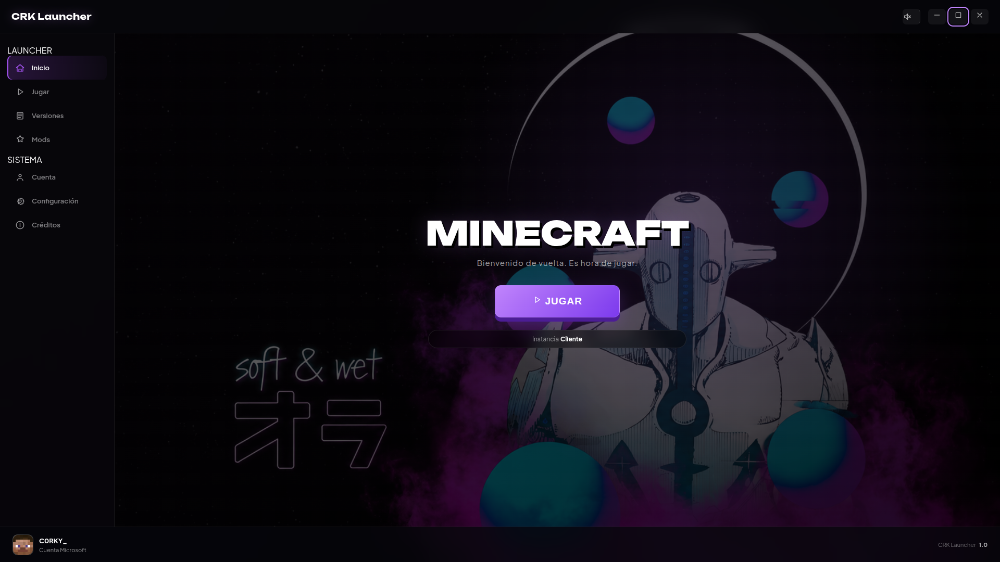

# CRK Launcher

Un launcher de Minecraft con interfaz propia, construido con Electron, que se apoya en **Prism Launcher** (o **PolyMC**) para la parte pesada de descargar y ejecutar el juego.

No es una copia de Prism ni lo reemplaza — es una capa visual propia por encima, con funciones extra para crear instancias, gestionar mods y jugar sin tener que abrir la interfaz de Prism directamente.

> ⚠️ Este proyecto no está afiliado con Mojang, Microsoft, ni con el equipo de Prism Launcher / PolyMC. Es un proyecto personal e independiente.

---

## Capturas

**Inicio**



**Versiones**


---

## Funciones

- 🎮 **Crear instancias** de Minecraft directo desde el launcher — Vanilla, Fabric o Forge (Minecraft 1.13+ para Forge), sin tocar Prism.
- 🧩 **Mods de Modrinth**: buscar, instalar y desinstalar mods para cualquier instancia con mod loader.
- ✏️ **Gestión de instancias**: renombrar o borrar instancias existentes desde la propia interfaz.
- 👤 **Cuentas reales**: lee las cuentas ya vinculadas en Prism, permite cambiar entre ellas, y muestra la cara real de tu skin (vía Crafatar).
- ⚙️ **Configuración real**: RAM y resolución con sliders, aplicados de verdad a la instancia antes de lanzar el juego.
- 🎵 **Sonido**: música de fondo (con más de una pista para elegir) y efectos en botones, todo con control de volumen y silencio.
- 🖥️ **Multiplataforma**: detecta automáticamente Windows, macOS y Linux (tanto instalaciones Flatpak como nativas de Prism/PolyMC).
- 🎨 Interfaz propia con identidad visual, tipografías autohospedadas (sin depender de internet) y microinteracciones cuidadas.

---

## Requisitos

- [Node.js](https://nodejs.org/) 18 o superior
- [Prism Launcher](https://prismlauncher.org/) instalado (o [PolyMC](https://polymc.org/), aunque ya no se mantiene activamente)
- Una cuenta de Minecraft ya vinculada en Prism (para jugar en línea)

---

## Instalación

```bash
# Clona el repositorio
git clone https://github.com/C0RKY23/Milauncher.git
cd Milauncher

# Instala las dependencias
npm install

# Corre el launcher
npm start
```

---

## Tecnologías

- [Electron](https://www.electronjs.org/) — interfaz de escritorio
- [Prism Launcher](https://prismlauncher.org/) / [PolyMC](https://polymc.org/) — motor de instalación y ejecución de Minecraft
- [Modrinth API](https://docs.modrinth.com/) — búsqueda e instalación de mods
- [Fabric](https://fabricmc.net/) / [Forge](https://minecraftforge.net/) — mod loaders soportados al crear instancias
- [Crafatar](https://crafatar.com/) — renderizado de caras de skin
- Tipografías: [Plus Jakarta Sans](https://fonts.google.com/specimen/Plus+Jakarta+Sans) y [Unbounded](https://fonts.google.com/specimen/Unbounded) (autohospedadas)

---

## Estado del proyecto

Este es un proyecto personal en desarrollo activo. Algunas funciones (como Forge) dependen de servicios externos y de la versión de Minecraft elegida — si algo no funciona como se espera, es bienvenido abrir un issue.

## Licencia

Este proyecto está bajo la licencia MIT — ver el archivo [LICENSE](LICENSE) para más detalles.
